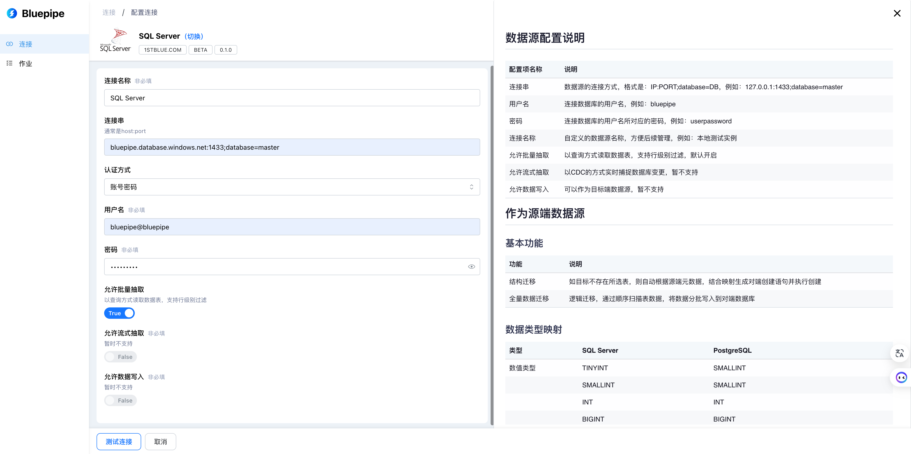
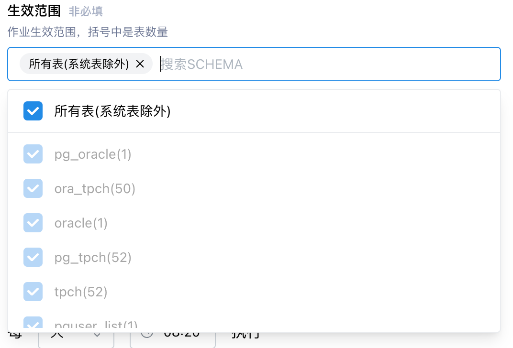
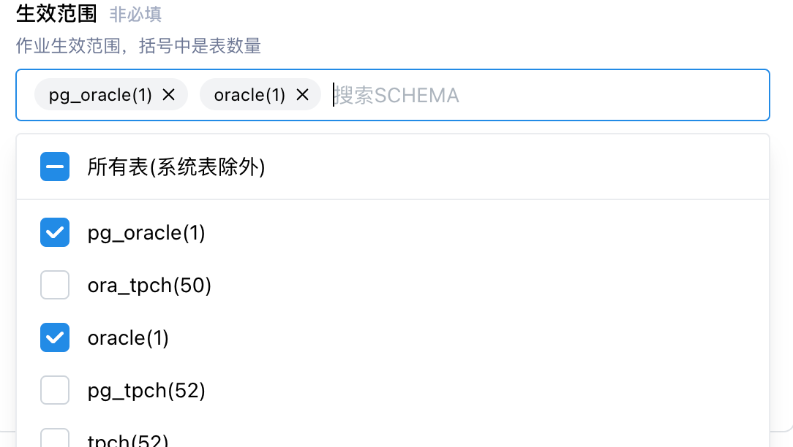
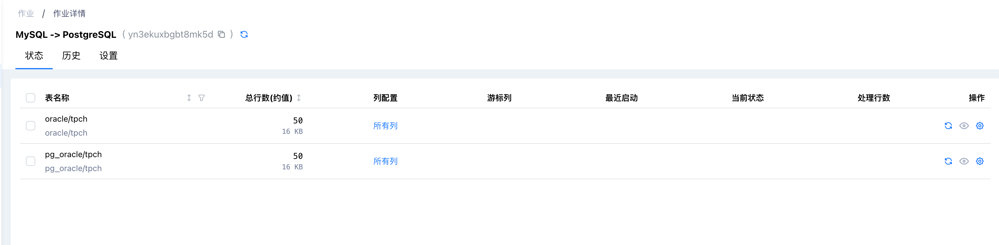

# Release Notes (v0.9.5)

## 主要变化

### 支持通过定时器调度作业

* 允许配置定时策略，以实现数据的自动复制。

:::caution 注意

此功能可能会与通过外部 API触发冲突，
:::

### 支持按`Schema`筛选复制范围

* 允许在作业配置

### 调度策略优化

* 基于深度优先的作业调度方式，避免大量作业同时提交时排队时间过长。

### 切分策略优化

* 新增基于非 Number 列的切分支持，以提升复制过程中的并行度；
* 优化切分列选择策略，规避数据倾斜。

## 连接器

## 新增`SQL Server`

* 支持通过批量方式读取数据；
* 暂未支持基于日志订阅的 CDC 能力；
* 暂未支持数据写入能力。

## 新增SQLServer连接器

- 支持数据读取，支持行级别过滤
- 暂未支持 CDC 读取及数据写入
  

## 作业生效范围更细致

- 在创建作业时，我们将生效范围的粒度下放到了schema级别，您可以按 SCHEMA 选择需要同步的表
  
  
  

## 新增定时调度方式

- 我们为调度方式新增了定时任务选项，支持按天、按小时批量同步

- 您可以在作业右上角查看定时任务的运行情况，支持操作开启、暂停定时任务

- 作业历史页面增加了任务运行的来源，支持筛选，方便查看运行情况
  

## 调度策略全面优化

- 解决作业调度优先级问题
- 解决大作业影响整体资源利用率问题；
- 跑批切分策略优化，支持字符串主键切分，同时会对主键值域做些判断，以尽可能规避切分长尾。

